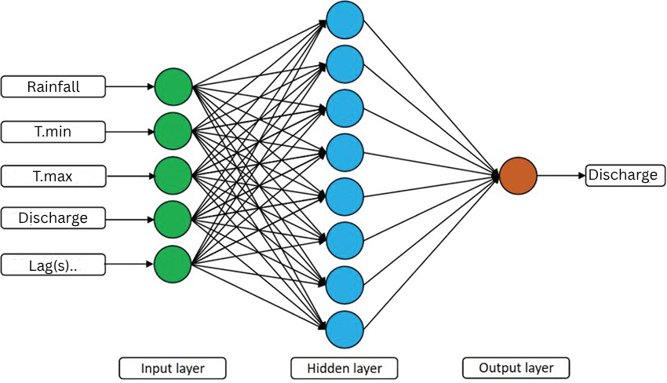
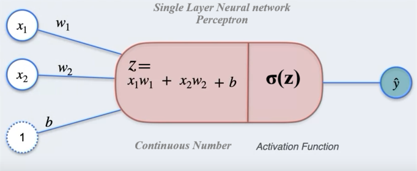
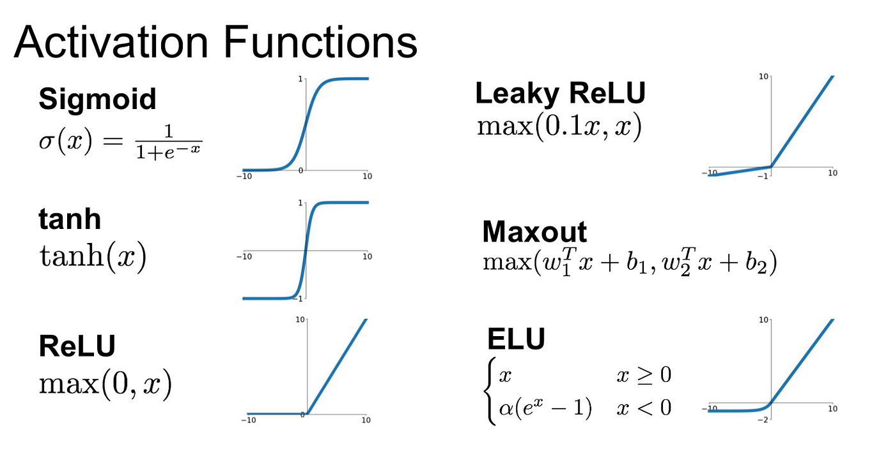

# Artificial Neural Networks (ANN)

## 🧠 Overview

Artificial Neural Networks are powerful machine learning models inspired by biological neural networks. They can capture complex, non-linear relationships in hydrological data that traditional regression methods might miss.

## 🏗️ Network Architecture



### Mathematical Foundation



The basic neuron computation:
$$y = f\left(\sum_{i=1}^{n} w_i x_i + b\right)$$

Where:
- $x_i$ = Input features
- $w_i$ = Weights
- $b$ = Bias
- $f$ = Activation function

## 🔨 Implementation

### Step 1: Import Libraries

```python
import pandas as pd
import numpy as np
from sklearn.model_selection import train_test_split
from sklearn.preprocessing import StandardScaler
import tensorflow as tf
from tensorflow import keras
from keras import Sequential
from keras.layers import Dense, Dropout
from keras.optimizers import Adam
from keras import backend as K
import matplotlib.pyplot as plt
import warnings

warnings.filterwarnings('ignore')
np.random.seed(42)
tf.random.set_seed(42)
```

### Step 2: Data Preparation

> 📥 **Before you begin:** Download the discharge dataset here: [Discharge_30years.csv](../assets/data/Discharge_30years.csv)

```python
# Load data
df = pd.read_csv('Discharge_30years.csv', 
                 parse_dates=['Date'], 
                 index_col='Date')
# Feature engineering (same as MLR)
INPUTS = df.iloc[:, :-1]
OUTPUT = df.iloc[:, -1]

# Create lag features
rain_lags = [1, 2, 3]
tmax_lags = [1, 2, 3]
tmin_lags = [1, 2, 3]

for lag in rain_lags:
    INPUTS[f'Rainfall_lag{lag}'] = INPUTS['Rainfall'].shift(lag)
for lag in tmax_lags:
    INPUTS[f'Tmax_lag{lag}'] = INPUTS['Tmax'].shift(lag)
for lag in tmin_lags:
    INPUTS[f'Tmin_lag{lag}'] = INPUTS['Tmin'].shift(lag)

# Clean data
FEATURES = INPUTS.dropna()
TARGET = OUTPUT.loc[FEATURES.index]
```

### Step 3: Feature Scaling

```python
# Scale features
X_scaler = StandardScaler()
X_scaled = X_scaler.fit_transform(FEATURES)

# Scale target
y_scaler = StandardScaler()
y_scaled = y_scaler.fit_transform(TARGET.values.reshape(-1, 1)).flatten()

print("Scaling complete!")
print(f"Features mean: {X_scaled.mean():.4f}, std: {X_scaled.std():.4f}")
print(f"Target mean: {y_scaled.mean():.4f}, std: {y_scaled.std():.4f}")
```

### Step 4: Train-Test Split

```python
X_train_scaled, X_test_scaled, y_train_scaled, y_test_scaled = train_test_split(
    X_scaled, y_scaled, 
    test_size=0.2, 
    shuffle=False
)

print(f"Training samples: {len(X_train_scaled)}")
print(f"Testing samples: {len(X_test_scaled)}")
```

### Step 5: Define Hyperparameters

```python
# Model architecture
INPUT_DIM = X_train_scaled.shape[1]
HIDDEN_LAYERS = [32, 16]
DROPOUTS = [0.3, 0.2]
ACTIVATION = 'relu'

# Training parameters
OPTIMIZER = 'adam'
LEARNING_RATE = 0.001
EPOCHS = 100
BATCH_SIZE = 32

print(f"Input dimension: {INPUT_DIM}")
print(f"Hidden layers: {HIDDEN_LAYERS}")
print(f"Activation: {ACTIVATION}")
```

### Step 6: Build the Model

```python
# Clear any existing models
K.clear_session()

# Build model
model = Sequential()

# First hidden layer with input
model.add(Dense(HIDDEN_LAYERS[0], 
                input_dim=INPUT_DIM, 
                activation=ACTIVATION))
model.add(Dropout(DROPOUTS[0]))

# Additional hidden layers
for i, units in enumerate(HIDDEN_LAYERS[1:], 1):
    model.add(Dense(units, activation=ACTIVATION))
    if i < len(DROPOUTS):
        model.add(Dropout(DROPOUTS[i]))

# Output layer
model.add(Dense(1))  # No activation for regression

# Compile model
optimizer = Adam(learning_rate=LEARNING_RATE)
model.compile(optimizer=optimizer, loss='mse', metrics=['mae'])

# Model summary
model.summary()
```

### Step 7: Train the Model

```python
# Train with early stopping
from keras.callbacks import EarlyStopping

early_stop = EarlyStopping(
    monitor='loss',
    patience=10,
    restore_best_weights=True
)

history = model.fit(
    X_train_scaled, y_train_scaled,
    epochs=EPOCHS,
    batch_size=BATCH_SIZE,
    validation_split=0.1,
    callbacks=[early_stop],
    verbose=1
)
```

### Step 8: Make Predictions

```python
# Predict on test set
y_pred_scaled = model.predict(X_test_scaled)

# Inverse transform to original scale
y_pred = y_scaler.inverse_transform(y_pred_scaled)
y_true = y_scaler.inverse_transform(y_test_scaled.reshape(-1, 1))

print(f"Predictions shape: {y_pred.shape}")
```

## 📈 Model Evaluation

```python
# Evaluate performance
def evaluate_model(obs, sim):
    obs = np.array(obs).flatten()
    sim = np.array(sim).flatten()
    
    r = np.corrcoef(obs, sim)[0, 1]
    r2 = r ** 2
    nse = 1 - np.sum((obs - sim) ** 2) / np.sum((obs - np.mean(obs)) ** 2)
    pbias = 100 * np.sum(obs - sim) / np.sum(obs)
    
    return {'R²': r2, 'NSE': nse, 'PBIAS': pbias}

results = evaluate_model(y_true, y_pred)
print(f"Test Performance:")
print(f"  R² = {results['R²']:.4f}")
print(f"  NSE = {results['NSE']:.4f}")
print(f"  PBIAS = {results['PBIAS']:.2f}%")
```

## 📊 Visualizations

### Training History

```python
fig, axes = plt.subplots(1, 2, figsize=(12, 4))

# Loss
axes[0].plot(history.history['loss'], label='Training Loss')
if 'val_loss' in history.history:
    axes[0].plot(history.history['val_loss'], label='Validation Loss')
axes[0].set_xlabel('Epoch')
axes[0].set_ylabel('Loss (MSE)')
axes[0].set_title('Model Loss During Training')
axes[0].legend()
axes[0].grid(True, alpha=0.3)

# MAE
axes[1].plot(history.history['mae'], label='Training MAE')
if 'val_mae' in history.history:
    axes[1].plot(history.history['val_mae'], label='Validation MAE')
axes[1].set_xlabel('Epoch')
axes[1].set_ylabel('MAE')
axes[1].set_title('Mean Absolute Error During Training')
axes[1].legend()
axes[1].grid(True, alpha=0.3)

plt.tight_layout()
plt.show()
```

### Predictions vs Observations

```python
plt.figure(figsize=(14, 6))

# Time series plot
test_dates = TARGET.iloc[-len(y_true):].index
plt.plot(test_dates, y_true, 'b-', label='Observed', alpha=0.7)
plt.plot(test_dates, y_pred, 'r-', label='ANN Predicted', alpha=0.7)

plt.xlabel('Date')
plt.ylabel('Discharge (m³/s)')
plt.title('ANN: Observed vs Predicted Discharge')
plt.legend()
plt.grid(True, alpha=0.3)
plt.xticks(rotation=45)
plt.tight_layout()
plt.show()
```

## 🎛️ Hyperparameter Tuning

### Grid Search Example

```python
def create_model(hidden_layers, activation, learning_rate):
    K.clear_session()
    model = Sequential()
    
    # First layer
    model.add(Dense(hidden_layers[0], 
                   input_dim=INPUT_DIM, 
                   activation=activation))
    model.add(Dropout(0.2))
    
    # Additional layers
    for units in hidden_layers[1:]:
        model.add(Dense(units, activation=activation))
        model.add(Dropout(0.2))
    
    # Output
    model.add(Dense(1))
    
    # Compile
    optimizer = Adam(learning_rate=learning_rate)
    model.compile(optimizer=optimizer, loss='mse')
    
    return model

# Define hyperparameter grid
param_grid = {
    'hidden_layers': [[32, 16], [64, 32], [128, 64, 32]],
    'activation': ['relu', 'tanh'],
    'learning_rate': [0.001, 0.01, 0.0001]
}

# Note: Full grid search implementation would go here
```

## 🎯 Activation Functions



### Common Activation Functions

| Function | Formula | Range | Use Case |
|----------|---------|-------|----------|
| ReLU | $f(x) = max(0, x)$ | [0, ∞) | Hidden layers (default) |
| Tanh | $f(x) = tanh(x)$ | [-1, 1] | Hidden layers (centered) |
| Sigmoid | $f(x) = 1/(1 + e^{-x})$ | [0, 1] | Binary classification |
| Linear | $f(x) = x$ | (-∞, ∞) | Regression output |

## 📚 Learning Rate Impact


## ✅ Best Practices

1. **Always scale inputs**: Neural networks are sensitive to input scale
2. **Start simple**: Begin with fewer layers and neurons
3. **Monitor overfitting**: Use validation data and early stopping
4. **Experiment with architectures**: Try different layer configurations
5. **Use dropout**: Prevents overfitting by randomly dropping neurons
6. **Set random seeds**: For reproducible results
7. **Save best models**: Use callbacks to save the best performing model

## ⚠️ Common Issues and Solutions

| Issue | Symptom | Solution |
|-------|---------|----------|
| Overfitting | Train loss << Test loss | Add dropout, reduce layers, early stopping |
| Underfitting | Poor performance overall | Add layers/neurons, train longer |
| Exploding gradients | Loss becomes NaN | Reduce learning rate, use gradient clipping |
| Slow convergence | Loss decreases slowly | Increase learning rate, change optimizer |
| Unstable training | Loss fluctuates wildly | Reduce learning rate, increase batch size |

## 🔄 Model Comparison

```python
# Compare all three models
comparison = pd.DataFrame({
    'Model': ['SLR', 'MLR', 'ANN'],
    'R²': [0.65, 0.78, results['R²']],
    'NSE': [0.60, 0.75, results['NSE']],
    'PBIAS': [5.2, 2.1, results['PBIAS']],
    'Training Time': ['<1s', '<1s', '~30s'],
    'Interpretability': ['High', 'High', 'Low'],
    'Complexity': ['Low', 'Medium', 'High']
})

print("Model Comparison:")
print(comparison.to_string(index=False))
```

## 🚀 Advanced Techniques

### 1. LSTM for Time Series

```python
from keras.layers import LSTM

# LSTM model for sequential data
lstm_model = Sequential([
    LSTM(50, activation='relu', input_shape=(n_steps, n_features)),
    Dropout(0.2),
    Dense(25, activation='relu'),
    Dense(1)
])
```

### 2. Ensemble Methods

```python
# Combine predictions from multiple models
ensemble_pred = (mlr_pred + ann_pred) / 2
```

### 3. Hyperparameter Optimization with Keras Tuner

```python
# pip install keras-tuner
import keras_tuner as kt

def build_model(hp):
    model = Sequential()
    
    # Tune the number of layers and neurons
    for i in range(hp.Int('n_layers', 2, 4)):
        model.add(Dense(
            hp.Int(f'units_{i}', 16, 128, step=16),
            activation='relu'
        ))
        model.add(Dropout(hp.Float(f'dropout_{i}', 0, 0.5, step=0.1)))
    
    model.add(Dense(1))
    
    model.compile(
        optimizer=Adam(hp.Float('learning_rate', 1e-4, 1e-2, sampling='LOG')),
        loss='mse'
    )
    
    return model
```

## 📊 Final Comparison Visualization

```python
# Create comprehensive comparison plot
fig, axes = plt.subplots(2, 2, figsize=(15, 12))

models = {
    'SLR': {'pred': slr_pred, 'color': 'green'},
    'MLR': {'pred': mlr_pred, 'color': 'blue'},
    'ANN': {'pred': y_pred.flatten(), 'color': 'red'}
}

# 1. All models time series
ax = axes[0, 0]
ax.plot(test_dates, y_true, 'k-', label='Observed', linewidth=2, alpha=0.7)
for name, data in models.items():
    ax.plot(test_dates[:len(data['pred'])], data['pred'], 
           color=data['color'], label=name, alpha=0.7)
ax.set_xlabel('Date')
ax.set_ylabel('Discharge (m³/s)')
ax.set_title('All Models Comparison')
ax.legend()
ax.grid(True, alpha=0.3)

# 2. Scatter plots for each model
for idx, (name, data) in enumerate(models.items()):
    row = (idx + 1) // 2
    col = (idx + 1) % 2
    ax = axes[row, col]
    
    ax.scatter(y_true[:len(data['pred'])], data['pred'], 
              alpha=0.5, s=20, color=data['color'])
    
    # Perfect prediction line
    min_val = min(y_true.min(), data['pred'].min())
    max_val = max(y_true.max(), data['pred'].max())
    ax.plot([min_val, max_val], [min_val, max_val], 'k--', alpha=0.5)
    
    ax.set_xlabel('Observed')
    ax.set_ylabel('Predicted')
    ax.set_title(f'{name} Model')
    ax.grid(True, alpha=0.3)

plt.suptitle('Comprehensive Model Comparison', fontsize=16, fontweight='bold')
plt.tight_layout()
plt.show()
```

## 🎯 When to Use ANNs

### ✅ Use ANNs when:
- You have large datasets (>5000 samples)
- Relationships are highly non-linear
- Multiple complex interactions exist
- High accuracy is more important than interpretability
- You have computational resources

### ❌ Avoid ANNs when:
- Dataset is small (<1000 samples)
- Interpretability is crucial
- Quick results are needed
- Limited computational resources
- Simple relationships exist

## 📚 Assignment

As mentioned in the original notebook, evaluate and visualize model performance over **training data** as well as test data to check for overfitting:

```python
# Predict on training data
y_train_pred_scaled = model.predict(X_train_scaled)
y_train_pred = y_scaler.inverse_transform(y_train_pred_scaled)
y_train_true = y_scaler.inverse_transform(y_train_scaled.reshape(-1, 1))

# Evaluate training performance
train_results = evaluate_model(y_train_true, y_train_pred)
test_results = evaluate_model(y_true, y_pred)

# Compare
print("Performance Comparison:")
print(f"Training R²: {train_results['R²']:.4f} | Test R²: {test_results['R²']:.4f}")
print(f"Training NSE: {train_results['NSE']:.4f} | Test NSE: {test_results['NSE']:.4f}")

# Check for overfitting
if train_results['R²'] - test_results['R²'] > 0.1:
    print("⚠️ Warning: Model may be overfitting!")
```

## 🚀 Next Steps

1. Experiment with different architectures
2. Try LSTM or GRU for better time series modeling
3. Implement cross-validation for robust evaluation
4. Explore [Time Series Libraries](../resources/libraries.md) for advanced models
5. Apply transfer learning from pre-trained models

## 📖 Further Reading

- [Deep Learning for Time Series Forecasting](https://machinelearningmastery.com/deep-learning-for-time-series-forecasting/)
- [TensorFlow Time Series Tutorial](https://www.tensorflow.org/tutorials/structured_data/time_series)
- [Keras Documentation](https://keras.io/)

---

<div class="grid" markdown>

:material-arrow-left: [Multiple Linear Regression](multiple-linear-regression.md){ .md-button }

:material-arrow-right: [Time Series Libraries](../resources/libraries.md){ .md-button .md-button--primary }

</div>