# Multiple Linear Regression (MLR)

## 📊 Overview

Multiple Linear Regression extends Simple Linear Regression by incorporating **multiple independent variables** to predict the dependent variable. In hydrology, this allows us to consider rainfall, temperature, and other factors simultaneously.

## 🎯 Mathematical Foundation

### The MLR Equation

$$
y = \beta_0 + \beta_1x_1 + \beta_2x_2 + ... + \beta_nx_n + \varepsilon
$$

Where:
- $y$ = Dependent variable (Discharge)
- $x_1, x_2, ..., x_n$ = Independent variables (Rainfall, Tmax, Tmin, lag features)
- $\beta_0$ = Intercept
- $\beta_1, \beta_2, ..., \beta_n$ = Coefficients for each variable
- $\varepsilon$ = Error term

### Visual Representation

```mermaid
graph LR
    A[Rainfall] --> E[MLR Model]
    B[Tmax] --> E
    C[Tmin] --> E
    D[Lag Features] --> E
    E --> F[Discharge Prediction]
    G[Error ε] --> E
```




## 🔨 Implementation

### Step 1: Import Libraries and Load Data

```python
import pandas as pd
import numpy as np
from sklearn.model_selection import train_test_split
from sklearn.linear_model import LinearRegression
from sklearn.preprocessing import StandardScaler
import matplotlib.pyplot as plt
import seaborn as sns

# Load data
df = pd.read_csv('Discharge_30years.csv', 
                 parse_dates=['Date'], 
                 index_col='Date')
df = df.sort_values('Date')
```

### Step 2: Feature Engineering

```python
# Separate inputs and outputs
INPUTS = df.iloc[:, :-1]  # All columns except Discharge
OUTPUT = df.iloc[:, -1]    # Discharge column

# Create lag features based on CCF analysis
rain_lags = [1, 2, 3]
tmax_lags = [1, 2, 3]
tmin_lags = [1, 2, 3]

# Add lag features
for lag in rain_lags:
    INPUTS[f'Rainfall_lag{lag}'] = INPUTS['Rainfall'].shift(lag)

for lag in tmax_lags:
    INPUTS[f'Tmax_lag{lag}'] = INPUTS['Tmax'].shift(lag)

for lag in tmin_lags:
    INPUTS[f'Tmin_lag{lag}'] = INPUTS['Tmin'].shift(lag)

# Remove rows with NaN values
FEATURES = INPUTS.dropna()
TARGET = OUTPUT.loc[FEATURES.index]

print(f"Features shape: {FEATURES.shape}")
print(f"Target shape: {TARGET.shape}")
print(f"\nFeature columns:")
print(FEATURES.columns.tolist())
```

### Step 3: Train-Test Split

```python
# Split data: 80% training, 20% testing
X_mlr_train, X_mlr_test, y_mlr_train, y_mlr_test = train_test_split(
    FEATURES, TARGET, 
    test_size=0.2, 
    shuffle=False  # Maintain temporal order
)

print(f"Training samples: {len(X_mlr_train)}")
print(f"Testing samples: {len(X_mlr_test)}")
```

### Step 4: Build and Train MLR Model

```python
# Initialize and train the model
mlr_model = LinearRegression()
mlr_model.fit(X_mlr_train, y_mlr_train)

# Make predictions
y_mlr_pred = mlr_model.predict(X_mlr_test)

print("Model trained successfully!")
```

### Step 5: Extract Model Equation

```python
# Get coefficients and intercept
feature_names = FEATURES.columns
coefficients = mlr_model.coef_
intercept = mlr_model.intercept_

# Create equation string
equation = f"Discharge = {intercept:.3f}"
for name, coef in zip(feature_names, coefficients):
    if coef >= 0:
        equation += f" + {coef:.4f}×{name}"
    else:
        equation += f" - {abs(coef):.4f}×{name}"

print("Fitted Equation:")
print("="*50)
print(equation)
print("="*50)

# Create a DataFrame for better visualization
coef_df = pd.DataFrame({
    'Feature': feature_names,
    'Coefficient': coefficients
}).sort_values('Coefficient', ascending=False)

print("\nFeature Coefficients (sorted by magnitude):")
print(coef_df)
```

## 📈 Model Evaluation

### Performance Metrics

```python
def evaluate_model(obs, sim):
    """Calculate R², NSE, and PBIAS"""
    obs = np.array(obs)
    sim = np.array(sim)
    
    # R²
    r = np.corrcoef(obs, sim)[0, 1]
    r2 = r ** 2
    
    # NSE
    nse = 1 - np.sum((obs - sim) ** 2) / np.sum((obs - np.mean(obs)) ** 2)
    
    # PBIAS
    pbias = 100 * np.sum(obs - sim) / np.sum(obs)
    
    return {'R²': r2, 'NSE': nse, 'PBIAS': pbias}

# Evaluate the model
results = evaluate_model(y_mlr_test, y_mlr_pred)

print("Model Performance:")
print(f"  R² = {results['R²']:.4f}")
print(f"  NSE = {results['NSE']:.4f}")
print(f"  PBIAS = {results['PBIAS']:.2f}%")
```

### Performance Comparison Table

```python
# Compare with SLR (if you've run it)
comparison_df = pd.DataFrame({
    'Model': ['SLR (Rainfall only)', 'MLR (All features)'],
    'R²': [0.65, results['R²']],  # Example SLR value
    'NSE': [0.60, results['NSE']],
    'PBIAS': [5.2, results['PBIAS']]
})

print("\nModel Comparison:")
print(comparison_df)
```

## 📊 Visualizations

### 1. Predicted vs Observed Scatter Plot

```python
plt.figure(figsize=(10, 8))

# Scatter plot
plt.scatter(y_mlr_test, y_mlr_pred, alpha=0.5, s=20, label='Predictions')

# Perfect prediction line
min_val = min(y_mlr_test.min(), y_mlr_pred.min())
max_val = max(y_mlr_test.max(), y_mlr_pred.max())
plt.plot([min_val, max_val], [min_val, max_val], 'r--', 
         label='Perfect Prediction', linewidth=2)

# Add metrics to plot
textstr = f'R² = {results["R²"]:.3f}\nNSE = {results["NSE"]:.3f}\nPBIAS = {results["PBIAS"]:.2f}%'
plt.text(0.05, 0.95, textstr, transform=plt.gca().transAxes,
         fontsize=12, verticalalignment='top',
         bbox=dict(boxstyle='round', facecolor='wheat', alpha=0.8))

plt.xlabel('Observed Discharge (m³/s)', fontsize=12)
plt.ylabel('Predicted Discharge (m³/s)', fontsize=12)
plt.title('MLR: Predicted vs Observed Discharge', fontsize=14, fontweight='bold')
plt.legend(loc='lower right')
plt.grid(True, alpha=0.3)
plt.axis('equal')
plt.tight_layout()
plt.show()
```

### 2. Time Series Comparison

```python
plt.figure(figsize=(15, 6))

# Get test dates
test_dates = y_mlr_test.index

# Plot observed and predicted
plt.plot(test_dates, y_mlr_test.values, 'b-', label='Observed', 
         linewidth=1.5, alpha=0.7)
plt.plot(test_dates, y_mlr_pred, 'r-', label='Predicted', 
         linewidth=1.5, alpha=0.7)

# Fill between for error visualization
plt.fill_between(test_dates, y_mlr_test.values, y_mlr_pred, 
                 alpha=0.2, color='gray')

plt.xlabel('Date', fontsize=12)
plt.ylabel('Discharge (m³/s)', fontsize=12)
plt.title('MLR: Time Series Comparison', fontsize=14, fontweight='bold')
plt.legend(loc='upper right')
plt.grid(True, alpha=0.3)
plt.xticks(rotation=45)
plt.tight_layout()
plt.show()
```

### 3. Feature Importance Visualization

```python
# Create feature importance plot
plt.figure(figsize=(10, 8))

# Sort coefficients by absolute value
coef_sorted = coef_df.iloc[np.argsort(np.abs(coef_df['Coefficient'].values))[::-1]]

# Create horizontal bar plot
colors = ['green' if x > 0 else 'red' for x in coef_sorted['Coefficient']]
plt.barh(range(len(coef_sorted)), coef_sorted['Coefficient'], color=colors)
plt.yticks(range(len(coef_sorted)), coef_sorted['Feature'])
plt.xlabel('Coefficient Value', fontsize=12)
plt.title('Feature Importance in MLR Model', fontsize=14, fontweight='bold')
plt.grid(True, alpha=0.3, axis='x')

# Add vertical line at x=0
plt.axvline(x=0, color='black', linestyle='-', linewidth=0.5)

plt.tight_layout()
plt.show()
```

### 4. Residual Analysis

```python
fig, axes = plt.subplots(2, 2, figsize=(12, 10))

# Calculate residuals
residuals = y_mlr_test - y_mlr_pred

# 1. Residuals vs Fitted
axes[0, 0].scatter(y_mlr_pred, residuals, alpha=0.5, s=20)
axes[0, 0].axhline(y=0, color='r', linestyle='--')
axes[0, 0].set_xlabel('Fitted Values')
axes[0, 0].set_ylabel('Residuals')
axes[0, 0].set_title('Residuals vs Fitted Values')
axes[0, 0].grid(True, alpha=0.3)

# 2. Q-Q Plot
from scipy import stats
stats.probplot(residuals, dist="norm", plot=axes[0, 1])
axes[0, 1].set_title('Q-Q Plot')
axes[0, 1].grid(True, alpha=0.3)

# 3. Histogram of Residuals
axes[1, 0].hist(residuals, bins=30, edgecolor='black', alpha=0.7)
axes[1, 0].set_xlabel('Residuals')
axes[1, 0].set_ylabel('Frequency')
axes[1, 0].set_title('Distribution of Residuals')
axes[1, 0].grid(True, alpha=0.3)

# Add normal distribution overlay
mu, std = residuals.mean(), residuals.std()
x = np.linspace(residuals.min(), residuals.max(), 100)
axes[1, 0].plot(x, stats.norm.pdf(x, mu, std) * len(residuals) * (residuals.max() - residuals.min()) / 30, 
                'r-', linewidth=2, label='Normal')
axes[1, 0].legend()

# 4. Residuals over Time
axes[1, 1].plot(test_dates, residuals, 'o-', alpha=0.5, markersize=4)
axes[1, 1].axhline(y=0, color='r', linestyle='--')
axes[1, 1].set_xlabel('Date')
axes[1, 1].set_ylabel('Residuals')
axes[1, 1].set_title('Residuals over Time')
axes[1, 1].grid(True, alpha=0.3)
axes[1, 1].tick_params(axis='x', rotation=45)

plt.suptitle('MLR Model Diagnostics', fontsize=16, fontweight='bold', y=1.02)
plt.tight_layout()
plt.show()
```

## 🔍 Model Interpretation

### Understanding Coefficients

```python
# Analyze coefficient signs and magnitudes
print("Model Interpretation:")
print("="*50)
print(f"Intercept: {intercept:.3f}")
print("  → Base discharge when all features = 0")
print()

for name, coef in zip(feature_names, coefficients):
    if 'Rainfall' in name:
        print(f"{name}: {coef:.4f}")
        if coef > 0:
            print(f"  → 1 mm increase in {name} increases discharge by {coef:.4f} m³/s")
    elif 'Tmax' in name:
        print(f"{name}: {coef:.4f}")
        if coef > 0:
            print(f"  → 1°C increase in {name} increases discharge by {coef:.4f} m³/s")
        else:
            print(f"  → 1°C increase in {name} decreases discharge by {abs(coef):.4f} m³/s")
```

## 🎯 Advantages and Limitations

### ✅ Advantages of MLR

- **Multiple Factors**: Considers various influences simultaneously
- **Interpretable**: Clear understanding of each variable's contribution
- **Fast**: Quick to train and predict
- **No Hyperparameters**: Simple to implement
- **Statistical Inference**: Can provide confidence intervals

### ❌ Limitations

- **Linearity Assumption**: Assumes linear relationships
- **Multicollinearity**: Correlated features can cause issues
- **No Interaction Capture**: Doesn't model feature interactions automatically
- **Sensitive to Outliers**: Can be skewed by extreme values
- **Assumes Independence**: Residuals should be independent

## 🚀 Improvements and Extensions

### 1. Feature Selection

```python
from sklearn.feature_selection import SelectKBest, f_regression

# Select top K features
selector = SelectKBest(score_func=f_regression, k=10)
X_selected = selector.fit_transform(X_mlr_train, y_mlr_train)

# Get selected feature names
selected_features = FEATURES.columns[selector.get_support()].tolist()
print(f"Selected features: {selected_features}")
```

### 2. Regularization (Ridge/Lasso)

```python
from sklearn.linear_model import Ridge, Lasso

# Ridge Regression
ridge_model = Ridge(alpha=1.0)
ridge_model.fit(X_mlr_train, y_mlr_train)

# Lasso Regression
lasso_model = Lasso(alpha=0.1)
lasso_model.fit(X_mlr_train, y_mlr_train)
```

### 3. Polynomial Features

```python
from sklearn.preprocessing import PolynomialFeatures

# Create polynomial features
poly = PolynomialFeatures(degree=2, include_bias=False)
X_poly = poly.fit_transform(X_mlr_train)
```

## 📚 Next Steps

Now that you've mastered MLR:
1. Try [Artificial Neural Networks](artificial-neural-network.md) for non-linear patterns
2. Experiment with more lag features
3. Apply regularization techniques
4. Compare with advanced models

---

<div class="grid" markdown>

:material-arrow-left: [Simple Linear Regression](simple-linear-regression.md){ .md-button }

:material-arrow-right: [Artificial Neural Network](artificial-neural-network.md){ .md-button .md-button--primary }

</div>