# Simple Linear Regression (SLR)

## 📊 Overview

Simple Linear Regression is a statistical method used to model the relationship between a **dependent variable** ($y$) and a **single independent variable** ($x$). In hydrology, we'll use it to predict discharge based on rainfall.

## 🎯 Mathematical Foundation

### The SLR Equation

$$
y = \beta_0 + \beta_1 x + \varepsilon
$$

Where:
- $y$ = Dependent variable (Discharge)
- $x$ = Independent variable (Rainfall)
- $\beta_0$ = Intercept (discharge when rainfall = 0)
- $\beta_1$ = Slope (change in discharge per unit rainfall)
- $\varepsilon$ = Random error term

### Visual Representation

```mermaid
graph LR
    A[Rainfall<br/>Input X] --> B[Linear Model<br/>y = β₀ + β₁x]
    B --> C[Discharge<br/>Output Y]
    D[Error ε] --> B
```



## 🔨 Implementation Steps

### Step 1: Data Preparation

```python
import pandas as pd
import numpy as np
from sklearn.model_selection import train_test_split
from sklearn.linear_model import LinearRegression
import matplotlib.pyplot as plt

# Load data
df = pd.read_csv('Discharge_30years.csv', 
                 parse_dates=['Date'], 
                 index_col='Date')
df = df.sort_values('Date')
```

### Step 2: Define Inputs and Outputs

```python
# For SLR, we use only Rainfall as input
X_slr = df[['Rainfall']]  # DataFrame with shape (n, 1)
y_slr = df['Discharge']    # Series with shape (n,)

print(f"Input shape: {X_slr.shape}")
print(f"Output shape: {y_slr.shape}")
```

!!! info "Why Double Brackets?"
    We use `df[['Rainfall']]` with double brackets to get a DataFrame (2D), not `df['Rainfall']` which returns a Series (1D). Scikit-learn expects 2D input.

### Step 3: Train-Test Split

```python
# Split data: 80% training, 20% testing
X_slr_train, X_slr_test, y_slr_train, y_slr_test = train_test_split(
    X_slr, y_slr, 
    test_size=0.2, 
    shuffle=False  # Important for time series!
)

print(f"Training samples: {len(X_slr_train)}")
print(f"Testing samples: {len(X_slr_test)}")
```

!!! warning "Time Series Consideration"
    We set `shuffle=False` to maintain temporal order. Shuffling time series data can lead to data leakage and unrealistic performance estimates.

### Step 4: Build and Train Model

```python
# Initialize the model
slr_model = LinearRegression()

# Train the model
slr_model.fit(X_slr_train, y_slr_train)

# Make predictions
y_slr_pred = slr_model.predict(X_slr_test)
```

### Step 5: Extract Model Parameters

```python
# Get the fitted equation parameters
slope = slr_model.coef_[0]
intercept = slr_model.intercept_

print(f"Fitted Equation: Discharge = {intercept:.4f} + {slope:.4f} × Rainfall")
print(f"Interpretation:")
print(f"  - Base discharge (no rain): {intercept:.4f} m³/s")
print(f"  - Discharge increase per mm rain: {slope:.4f} m³/s")
```

## 📈 Model Evaluation

### Performance Metrics Function

```python
def evaluate_model(obs, sim):
    """
    Calculate R², NSE, and PBIAS
    """
    obs = np.array(obs)
    sim = np.array(sim)
    
    # R² (Coefficient of Determination)
    r = np.corrcoef(obs, sim)[0, 1]
    r2 = r ** 2
    
    # NSE (Nash-Sutcliffe Efficiency)
    nse = 1 - np.sum((obs - sim) ** 2) / np.sum((obs - np.mean(obs)) ** 2)
    
    # PBIAS (Percent Bias)
    pbias = 100 * np.sum(obs - sim) / np.sum(obs)
    
    return {'R²': r2, 'NSE': nse, 'PBIAS': pbias}

# Evaluate the model
results = evaluate_model(y_slr_test, y_slr_pred)
print(f"Model Performance:")
print(f"  R² = {results['R²']:.3f}")
print(f"  NSE = {results['NSE']:.3f}")
print(f"  PBIAS = {results['PBIAS']:.2f}%")
```

### Performance Interpretation

| Metric | Range | Good Performance | Your Model |
|--------|-------|-----------------|------------|
| R² | 0 to 1 | > 0.6 | Check results |
| NSE | -∞ to 1 | > 0.5 | Check results |
| PBIAS | -∞ to +∞ | -10% to +10% | Check results |

## 📊 Visualization

### 1. Scatter Plot with Regression Line

```python
plt.figure(figsize=(10, 6))

# Training data
plt.scatter(X_slr_train, y_slr_train, alpha=0.5, s=10, 
            label='Training Data', color='blue')

# Test data
plt.scatter(X_slr_test, y_slr_test, alpha=0.5, s=10, 
            label='Test Data', color='green')

# Regression line
x_line = np.linspace(X_slr.min(), X_slr.max(), 100)
y_line = slr_model.predict(x_line)
plt.plot(x_line, y_line, 'r-', linewidth=2, 
         label=f'y = {intercept:.3f} + {slope:.3f}x')

plt.xlabel('Rainfall (mm)')
plt.ylabel('Discharge (m³/s)')
plt.title('Simple Linear Regression: Rainfall vs Discharge')
plt.legend()
plt.grid(True, alpha=0.3)
plt.show()
```

### 2. Predicted vs Observed

```python
plt.figure(figsize=(8, 8))

# Perfect prediction line
min_val = min(y_slr_test.min(), y_slr_pred.min())
max_val = max(y_slr_test.max(), y_slr_pred.max())
plt.plot([min_val, max_val], [min_val, max_val], 'r--', 
         label='Perfect Prediction', alpha=0.7)

# Scatter plot
plt.scatter(y_slr_test, y_slr_pred, alpha=0.6, s=20)

# Add R² to plot
plt.text(0.05, 0.95, f'R² = {results["R²"]:.3f}', 
         transform=plt.gca().transAxes,
         bbox=dict(boxstyle='round', facecolor='white', alpha=0.8))

plt.xlabel('Observed Discharge (m³/s)')
plt.ylabel('Predicted Discharge (m³/s)')
plt.title('Predicted vs Observed Discharge')
plt.legend()
plt.grid(True, alpha=0.3)
plt.axis('equal')
plt.show()
```

### 3. Time Series Comparison

```python
plt.figure(figsize=(14, 6))

# Get test dates
test_dates = y_slr_test.index

plt.plot(test_dates, y_slr_test.values, 'b-', label='Observed', alpha=0.7)
plt.plot(test_dates, y_slr_pred, 'r-', label='Predicted', alpha=0.7)

plt.fill_between(test_dates, y_slr_test.values, y_slr_pred, 
                 alpha=0.3, color='gray', label='Error')

plt.xlabel('Date')
plt.ylabel('Discharge (m³/s)')
plt.title('Time Series: Observed vs Predicted Discharge')
plt.legend()
plt.grid(True, alpha=0.3)
plt.xticks(rotation=45)
plt.tight_layout()
plt.show()
```

### 4. Residual Analysis

```python
fig, axes = plt.subplots(2, 2, figsize=(12, 10))

# Calculate residuals
residuals = y_slr_test - y_slr_pred

# 1. Residuals vs Fitted
axes[0, 0].scatter(y_slr_pred, residuals, alpha=0.6)
axes[0, 0].axhline(y=0, color='r', linestyle='--')
axes[0, 0].set_xlabel('Fitted Values')
axes[0, 0].set_ylabel('Residuals')
axes[0, 0].set_title('Residuals vs Fitted')
axes[0, 0].grid(True, alpha=0.3)

# 2. Q-Q Plot
from scipy import stats
stats.probplot(residuals, dist="norm", plot=axes[0, 1])
axes[0, 1].set_title('Q-Q Plot')
axes[0, 1].grid(True, alpha=0.3)

# 3. Histogram of Residuals
axes[1, 0].hist(residuals, bins=30, edgecolor='black', alpha=0.7)
axes[1, 0].set_xlabel('Residuals')
axes[1, 0].set_ylabel('Frequency')
axes[1, 0].set_title('Histogram of Residuals')
axes[1, 0].grid(True, alpha=0.3)

# 4. Residuals over Time
axes[1, 1].plot(test_dates, residuals, 'o-', alpha=0.6)
axes[1, 1].axhline(y=0, color='r', linestyle='--')
axes[1, 1].set_xlabel('Date')
axes[1, 1].set_ylabel('Residuals')
axes[1, 1].set_title('Residuals over Time')
axes[1, 1].grid(True, alpha=0.3)
axes[1, 1].tick_params(axis='x', rotation=45)

plt.tight_layout()
plt.show()
```

## 🎯 Model Limitations

!!! warning "SLR Limitations"
    1. **Linearity Assumption**: Assumes a straight-line relationship
    2. **Single Variable**: Only considers rainfall, ignoring other factors
    3. **No Lag Effects**: Doesn't account for delayed response
    4. **No Seasonality**: Ignores seasonal patterns
    5. **Homoscedasticity**: Assumes constant variance of errors

## 💡 When to Use SLR

### ✅ Good for:
- Quick baseline models
- Understanding basic relationships
- When you have limited data
- Educational purposes
- Initial exploratory analysis

### ❌ Not ideal for:
- Complex hydrological systems
- Multiple influencing factors
- Non-linear relationships
- Capturing temporal dependencies

## 🚀 Improvements

To improve your SLR model, consider:

1. **Log Transformation**: If relationship is exponential
   ```python
   X_log = np.log1p(X_slr)  # log(1 + x) to handle zeros
   ```

2. **Polynomial Features**: For curved relationships
   ```python
   from sklearn.preprocessing import PolynomialFeatures
   poly = PolynomialFeatures(degree=2)
   X_poly = poly.fit_transform(X_slr)
   ```

3. **Remove Outliers**: Improve model stability
   ```python
   # Remove points beyond 3 standard deviations
   z_scores = np.abs(stats.zscore(y_slr))
   mask = z_scores < 3
   X_clean = X_slr[mask]
   y_clean = y_slr[mask]
   ```

## 📚 Next Steps

Now that you understand SLR, proceed to:
- [Multiple Linear Regression](multiple-linear-regression.md) - Add more variables
- [Feature Engineering](../fundamentals/feature-engineering.md) - Create lag features
- [Neural Networks](artificial-neural-network.md) - Capture complex patterns

---

<div class="grid" markdown>

:material-arrow-left: [Feature Engineering](../fundamentals/feature-engineering.md){ .md-button }

:material-arrow-right: [Multiple Linear Regression](multiple-linear-regression.md){ .md-button .md-button--primary }

</div>