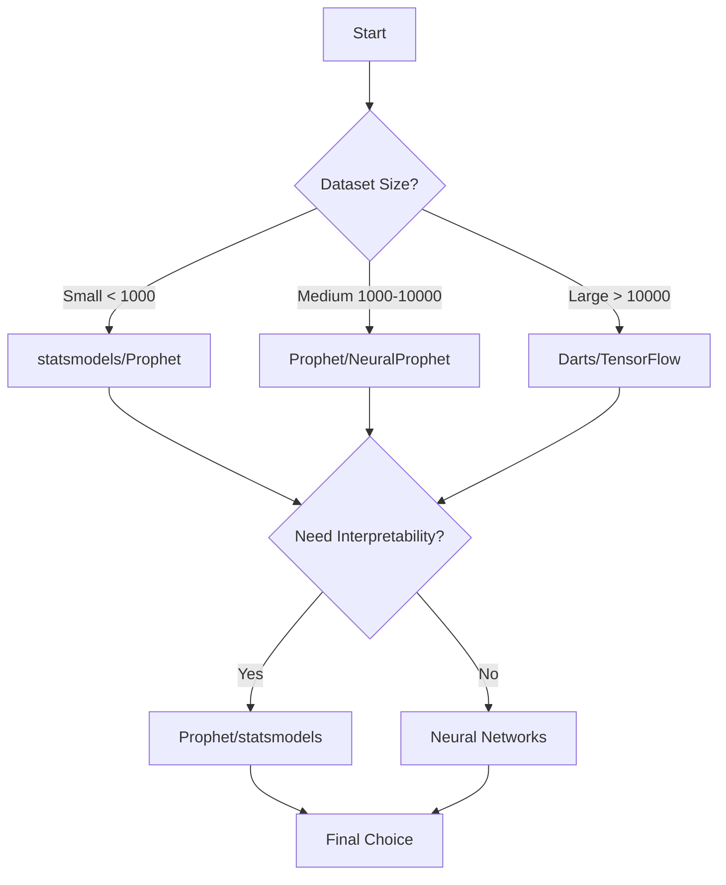

# Time Series Forecasting Libraries

## 📚 Overview

While this guide teaches you to build models from scratch, there are excellent pre-built libraries that can accelerate your time series forecasting projects. Here's a comprehensive guide to the best libraries available for hydrological and general time series forecasting.

## 🌟 Top Time Series Libraries

### 1. **Prophet** (by Meta/Facebook)


Prophet is designed for forecasting time series data with strong seasonal patterns and holiday effects.

**Best for**: Business forecasting, datasets with missing values, strong seasonality

```python
# Installation
pip install prophet

# Basic usage
from prophet import Prophet
import pandas as pd

# Prepare data
df = pd.DataFrame({
    'ds': dates,  # Date column
    'y': values   # Value column
})

# Create and fit model
model = Prophet()
model.fit(df)

# Make predictions
future = model.make_future_dataframe(periods=365)
forecast = model.predict(future)
```

**Key Features**:
- Automatic seasonality detection
- Holiday effects modeling
- Robust to missing data
- Uncertainty intervals

[📖 Documentation](https://facebook.github.io/prophet/) | [🔗 GitHub](https://github.com/facebook/prophet)

---

### 2. **statsmodels** - ARIMA & SARIMAX


Classical statistical models for time series analysis.

**Best for**: Traditional time series analysis, academic research, interpretable models

```python
# ARIMA Example
from statsmodels.tsa.arima.model import ARIMA

model = ARIMA(data, order=(1, 1, 1))  # (p, d, q)
model_fit = model.fit()
predictions = model_fit.forecast(steps=10)

# SARIMAX with exogenous variables
from statsmodels.tsa.statespace.sarimax import SARIMAX

model = SARIMAX(
    discharge_data,
    exog=rainfall_data,
    order=(1, 1, 1),
    seasonal_order=(1, 1, 1, 12)
)
```

**Key Features**:
- ARIMA, SARIMA, SARIMAX models
- Statistical tests (ADF, KPSS)
- ACF/PACF plots
- Comprehensive diagnostics

[📖 Documentation](https://www.statsmodels.org/)

---

### 3. **Darts** - Modern Time Series Library


A Python library for easy manipulation and forecasting of time series.

**Best for**: Modern deep learning approaches, multivariate forecasting, probabilistic forecasting

```python
# Installation
pip install darts

# Example with N-BEATS model
from darts import TimeSeries
from darts.models import NBEATSModel

# Convert pandas to Darts TimeSeries
series = TimeSeries.from_dataframe(df, 'date', 'discharge')

# Split data
train, val = series.split_before(0.8)

# Create and train model
model = NBEATSModel(
    input_chunk_length=30,
    output_chunk_length=7,
    n_epochs=100
)
model.fit(train)

# Predict
prediction = model.predict(n=30)
```

**Key Features**:
- 30+ forecasting models (classical & neural)
- Unified API
- Probabilistic forecasting
- Multivariate support
- Backtesting utilities

[📖 Documentation](https://unit8co.github.io/darts/) | [🔗 GitHub](https://github.com/unit8co/darts)

---

### 4. **NeuralProphet** - Neural Networks meet Prophet


Combines Prophet's interpretability with deep learning power.

**Best for**: Complex seasonality, automatic feature engineering, interpretable neural networks

```python
# Installation
pip install neuralprophet

from neuralprophet import NeuralProphet

model = NeuralProphet(
    n_forecasts=30,
    n_lags=30,
    yearly_seasonality=True,
    weekly_seasonality=False,
    daily_seasonality=False,
)

model.fit(df, freq='D')
future = model.make_future_dataframe(df, periods=365)
forecast = model.predict(future)
```

[📖 Documentation](https://neuralprophet.com/) | [🔗 GitHub](https://github.com/ourownstory/neural_prophet)

---

### 5. **sktime** - Unified Time Series Framework


Scikit-learn compatible library for time series.

**Best for**: Machine learning pipelines, ensemble methods, time series classification

```python
# Installation
pip install sktime

from sktime.forecasting.arima import AutoARIMA
from sktime.forecasting.compose import make_reduction

# AutoARIMA
forecaster = AutoARIMA(sp=12, suppress_warnings=True)
forecaster.fit(y_train)
y_pred = forecaster.predict(fh=[1, 2, 3, 4, 5])

# Using any sklearn regressor for forecasting
from sklearn.ensemble import RandomForestRegressor
forecaster = make_reduction(RandomForestRegressor(), window_length=10)
```

[📖 Documentation](https://www.sktime.net/) | [🔗 GitHub](https://github.com/sktime/sktime)

---

## 🌊 Hydrology-Specific Libraries

### 1. **HydroShare Python Client**
For accessing hydrological data:
```python
pip install hs_restclient
```

### 2. **PyETo** - Evapotranspiration Calculations
```python
pip install pyeto
```

### 3. **Pastas** - Time Series Analysis for Hydrology
Specifically designed for groundwater analysis:
```python
pip install pastas

import pastas as ps
model = ps.Model(head_series)
model.add_stressmodel(ps.StressModel(precipitation, ps.Gamma))
```

[🔗 Pastas Documentation](https://pastas.readthedocs.io/)

---

## 🚀 Advanced Deep Learning Libraries

### **TensorFlow/Keras Time Series**
For custom LSTM/GRU models:

```python
from tensorflow.keras.models import Sequential
from tensorflow.keras.layers import LSTM, Dense

model = Sequential([
    LSTM(50, activation='relu', input_shape=(n_steps, n_features)),
    Dense(1)
])
```

### **PyTorch Forecasting**
Advanced neural network models:

```python
pip install pytorch-forecasting

from pytorch_forecasting import TemporalFusionTransformer, TimeSeriesDataSet
```

---

## 📊 Comparison Table

| Library | Best For | Learning Curve | Performance | Interpretability |
|---------|----------|----------------|-------------|------------------|
| Prophet | Quick forecasting | Easy | Good | High |
| statsmodels | Classical methods | Medium | Good | Very High |
| Darts | Modern approaches | Medium | Excellent | Medium |
| NeuralProphet | Complex patterns | Medium | Very Good | High |
| sktime | ML pipelines | Easy | Good | High |
| TensorFlow | Custom models | Hard | Excellent | Low |

---

## 🎯 Choosing the Right Library

### Decision Tree



---

## 💻 Quick Start Templates

### Hydrological Forecasting Pipeline

```python
# Combined approach for discharge prediction
import pandas as pd
from prophet import Prophet
from darts import TimeSeries
from darts.models import NBEATSModel

# 1. Quick baseline with Prophet
def prophet_baseline(df):
    model = Prophet(
        changepoint_prior_scale=0.05,
        seasonality_mode='multiplicative'
    )
    model.add_regressor('rainfall')
    model.add_regressor('temperature')
    model.fit(df)
    return model

# 2. Advanced model with Darts
def neural_forecast(series, covariates):
    model = NBEATSModel(
        input_chunk_length=30,
        output_chunk_length=7,
        n_epochs=100
    )
    model.fit(
        series, 
        past_covariates=covariates,
        verbose=False
    )
    return model

# 3. Ensemble approach
def ensemble_forecast(df):
    prophet_pred = prophet_baseline(df).predict()
    neural_pred = neural_forecast(df).predict()
    return (prophet_pred + neural_pred) / 2
```

---

## 📖 Learning Resources

### Online Courses
- [Time Series Analysis in Python](https://www.datacamp.com/courses/time-series-analysis-in-python) - DataCamp
- [Practical Time Series Analysis](https://www.coursera.org/learn/practical-time-series-analysis) - Coursera

### Books
- "Forecasting: Principles and Practice" by Hyndman & Athanasopoulos (Free online)
- "Time Series Analysis and Its Applications" by Shumway & Stoffer

### Tutorials & Blogs
- [Machine Learning Mastery - Time Series](https://machinelearningmastery.com/category/time-series/)
- [Towards Data Science - Time Series Tag](https://towardsdatascience.com/tagged/time-series)

---

## 🔄 Integration with This Guide

You can combine these libraries with the techniques learned in this guide:

1. **Use this guide** to understand fundamentals
2. **Apply libraries** for production-ready solutions
3. **Combine approaches** for best results

Example integration:
```python
# Use our feature engineering
from our_guide import create_lag_features

# Apply to library models
features = create_lag_features(df)
model = Prophet()
model.add_regressor('rainfall_lag1')
model.fit(features)
```

---

!!! tip "Best Practice"
    Start with simple models (Prophet, ARIMA) to establish baselines, then move to complex models (neural networks) only if needed.

!!! warning "Data Requirements"
    Most neural network libraries require at least 1000+ observations for good performance.

---

<div class="grid" markdown>

:material-arrow-left: [Artificial Neural Network](../models/artificial-neural-network.md){ .md-button }

:material-home: [Home](../index.md){ .md-button .md-button--primary }